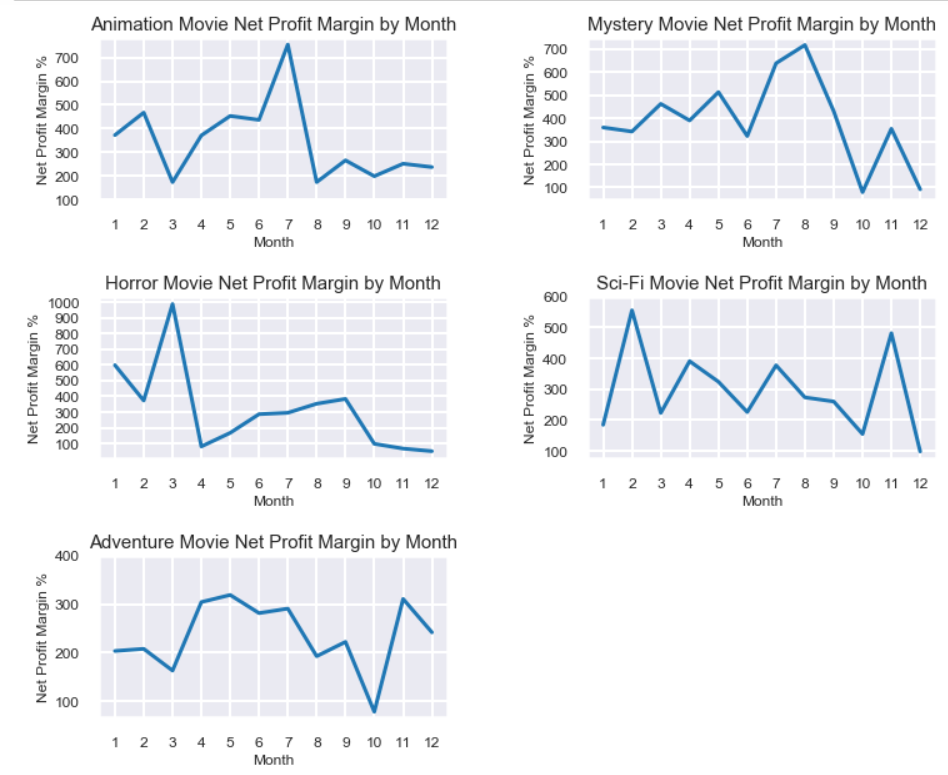
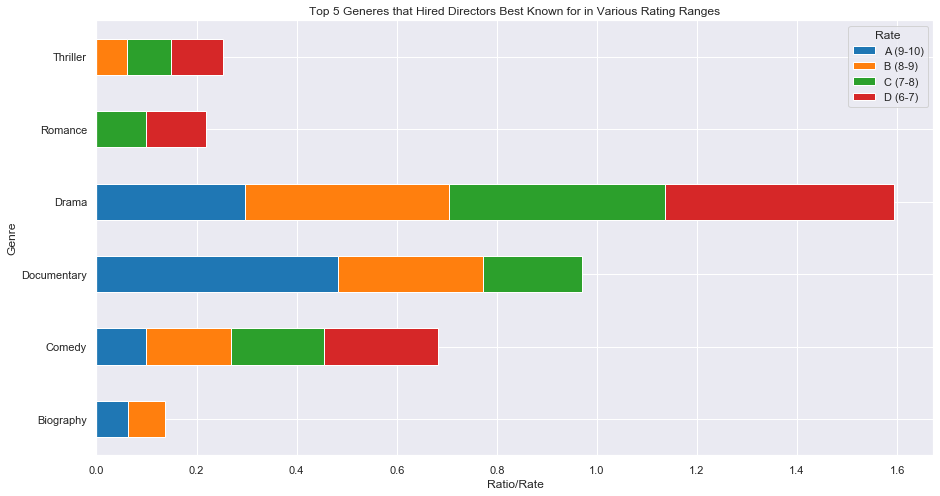
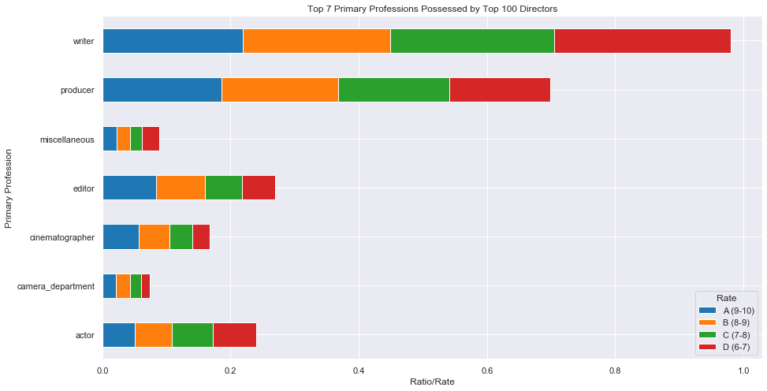

# Introduction:

Entering the movie industry is uncharted territory for Microsoft Studios. There is an opportunity for us to become profitable in this media but there is also a possibility for failure. We will be moving into a market with countless competitors and numerous established powerhouse studios. Creating films are expensive ventures and it is not enough to simply outspend our competitors. If we do not plan an effective strategy for our entry into the industry, we could potentially lose millions of dollars and our current endeavors will be all for naught.

Therefore, our process will need to be deliberate and calculated. If we focus on creating movies that movie audiences are highly interested in, there is a higher likelihood of us becoming established in this market and making money. We believe that there is insight to be had from the analysis of moviegoer trends and trying to formulate a strategy behind these trends. In this project, we postulate numerous questions and present several recommendations for our entry strategy based on the findings from our data analysis.

# Questions:

For our analysis, we decided to focus on two key aspects of filmmaking: the genre of film and the director. Picking which genre of film is integral to help shaping the development of the entire film. It is equally important to have full confidence in the director who will provide the overall vision of the film. Having directors who know their craft within genres they are known for will help facilitate smooth film production.

For our purposes, we will examine which genres are the most successful in the box office as well as which months of the year they perform the best. We will also look at the most highly regarded directors currently in the business. Below are the questions we analyzed and provide answers for:


 - 	What genre of films will have a better chance of producing box office numbers?
 - 	How does time of year affect profitability for certain genres?
 
### The following three questions were answered by Chun-Min (Mindy) Jen, student_v9.ipynb ###
 -  What genre of films are more likely being fond of the audience?  
 - 	Who are the directors creating high grossing films and highly rated films?
 -  What are primary professions (other than directors) of selective directors who conducted not only profitable but attractive movies?


# Data Setup:

The datasets we used in this project were originally from IMDB, The Movie Database, and The Numbers. They were presented as .csv files and most were in various states of disarray. Certain datasets needed to be initially cleaned before further analysis could be done. For the purposes of our research, all the films we analyzed were released between 2010 and 2019. We specifically chose this date range as we believe it contains the most accurate representation of current movie and audience trends. All the datasets used in this project are listed below:

 - 	IMDB:
        - imdb.name.basics.csv.gz
        - imdb.title.akas.csv.gz
        - imdb.title.basics.csv.gz
        - imdb.title.crew.csv.gz
        - imdb.title.principals.csv.gz
        - imdb.title.ratings.csv.gz
 - 	TMDB:
        - tmdb.movies.csv.gz
 - 	The Numbers:
        - tn.movie_budgets.csv.gz

# Choosing The Right Film Genres

Deciding on what type of film to make will greatly help the process of narrowing down the best director for the job. While one’s inclination may be to make a blockbuster action movie, we believe there is more nuance in selecting safer genres to target a release in. We wanted to determine the top ten genres that were the most profitable in terms of net profit margin. 

**Question 1: What genre of films will have a better chance of producing box office numbers?**


## Analysis:

We used tmdb.movies and tn.movie_budgets datasets for this question. For our analysis, we simply looked at specific genres in order to simplify our initial findings. The metric used for measuring a genre’s success was net profit margin, a measure of total revenue over total costs. We chose to specifically look at the median profit margin for each film genre as the key metric. The reason for this is that due to the massive fluctuations between total revenue and total expenses across filmmaking in general, the mean will be greatly inflated and won’t be an accurate measurement as a baseline. It is unreasonable to start planning big budget films without first seeing if we can achieve moderate success. 


All these genres had a median net profit margin of at least 200% with the highest being Mystery films at over 300%. Among the top ten genres, the five highest grossing film genres by profit margin were mystery, animation, horror, sci-fi, and adventure.


## Recommendations:

Creating films that can be classified as mystery, animation, horror, sci-fi, or adventure movies will provide a good starting point for us to strategize our initial movie plan. These types of films have shown to achieve a good deal of success and can act as a safe passage for us into this new and exciting time.

## Future Work:

It is not uncommon for films to be classified as more than one genre. Certain films have excelled at being able to combine themes and concepts from multiple genres into one feature. We would like to examine which genre combinations have been the most successful as a way of narrowing down films to create. We could potentially attract fans from multiple genres in doing so as a means of increasing audience numbers and profitability.

# Planning Our Release Dates

As we mentioned previously, we will be facing competition from studios who have been established within the industry for decades. Trying to compete with summer blockbusters right out of the gate is a risky endeavor that we do not have to take right from the start. Rather than try to simply mimic what our competitors are doing, we thought it would be a valid approach to target times of the year that will give our films the best chances of succeeding on their own accord. Following up from the findings of our first question, we took a closer look again

**Question 2: How does time of year affect profitability for certain genres?**



## Analysis:

We again used the tmdb.movies and tn.movie_budgets datasets for this question. We limited our focus onto the top five genres we determined from the previous question: mystery, animation, horror, sci-fi, and adventure movies. We grouped the genres together by the month they were released into theaters. We chose to graph their median net profit margin as we observed extremely high mean values that we feel would not be truly representative as a baseline comparison.

While determining the highest net profit margin month year-round could be valuable, we wanted to observe genres that had consistently high margins year-round. The reason for this is avoiding seasonality and restricting ourselves to times where we will most likely be facing stiff competition, such as the summer blockbuster time of the year. The highest profit margin we observed was by far horror movies during the year of March. Upon closer inspection, a number of extremely low budget and high grossing horror movies released in March are the cause for this. It is also important to note that October and December were observed to be low points for all these genres in terms of profitability.

Our benchmark for what is considered a high margin was at least 200%. The genres that appeared to have the most consistent high margins were animation, mystery and sci-fi movies. At least eight months of the year these genres surpassed the benchmark number.

## Recommendations:

Animation, Mystery and Sci-Fi movies perform consistently well year-round and we should feel confident releasing throughout most of the year. Depending on which genre of film we intend to make, we can choose the specific months where the highest margins were observed as our targeted release month. This would greatly increase our chances of profitability.

## Future Work:

It is interesting that all five genres observed low points in the fall and winter months. We think it's worth a closer examination on the movies released during these times. Examining whether this is the result of audience trends, the quality of films released, or some other factor we have not considered yet can pose interesting data moving forward. Equally as important as determining what makes a film a success is determining what makes a film flop.

---------------------------------------------------------------------------------------------------------------------------------------
# Planning Our Director Selection (Mindy Jen, student_v9.ipynb)

**Question 3: What genre of films are more likely being fond of the audience?**



## Analysis:

We combined all imdb* tabular data-sets to answer this question. We noticed that every single movie repeatedly showed up in combinatorial data-sets and they stood for a group of people who play various roles such as director, writer, editor, composer, actor, priducer, actress and so on in one given movie. Since our major emphasis on question 3 is to search for Top 100 directors as our final-lists for new movies, we removed all rows, except the one which contains each movie's director name and related information, e.g. primary profession. That is, we only kept one row that is exclusive for the sake of selecting Top 100 directors. Aside from the removal of redundant rows in one given movie, we further categorized all chosen movies, where the information of directors is sufficient enough for our analysis, into four separate groups based on the magnitude of average rating of every movie. These four rating regions range from 9-10, 8-9, 7-8 down to 6-7. We didn't select any lower average rating than 6 in our new director selection process, for we would like to be sure that our hired director will conduct more innovate movie as anticipated in order to attract more votes from the audience.

A general idea is manifest by far. We, however, took one subtle thing into our consideration. Over a range of rating regions, i.e. from 6 to 7, 7 to 8, 8 to 9 and then upto 10, genres play different weights. Take documentary, documentary type of movies obtain higher ratings (and/or votes) than the rest of genres in the highest rating region (9-10). On the other hand, the rating of more drama movies fall into somewhat lower rating region that is broadly distributed between 6 and 9. This observation tells us the weight of each genre is different in different rating regions. Hence, to evaluate every director's performance, we account for which genre type of movie for which the director conducted.     

We calculated the director's performance based on the corresponding movie's average rating, and I assigned different weights depending on where the rating of one movie falls. For example, the director who once conducted one documentary movie with a lower rating will be given lower credit than the one who conduct the same documentary type of movie that obtained higher average rating. For directors who conducted drama movies with ratings between 9 and 10, they will obtain lower credit than those who also conducted drama movies but with lower average ratings ranging from 6 to 9. This is the way we assign different weights to different directors who conducted the same genre type of movies. 

In every given average rating region, the first 100 directors whose movies gained most average ratings were identified and chosen in our pool. Overall, we have 400 director candidates in our pool and we need to further narrow down our pool by applying stricter criteria to filtering out 95% of candidates. Our final-list is only composed of Top 5% director candidates. As a consequence, we further restricted the scope of our final-list selection by matching our 400 candidates' movies to the list of highly profitable movies as concluded in Mike's analyses.
To summarize, the answer to question 3 breaks down into 10 sub-questions as follows:

  - What're Top 5 genres in every sub-region of average rating?
  - Who're Top 100 directors in every sub-region of average rating?
  - What're movies conducted by Top 100 directors?
  - Could any movies conducted by Top 100 directors also be considered as highly profitable ones in Mike's list?
  - Who are Top directors who conducted high domestic profit movies as included in Mike's list for every rating sub-region?
  - Who are Top directors who conducted high worldwide profit movies as included in Mike's list for every rating sub-region?
  - What're released years for movies conducted by Top 100 directors for every rating sub-region?
  - To validate our observations, we also answer a question as below by means of analyzing different data-sets:
    * What's overall average vote for movies conducted by Top 100 directors?
    * How popular are movies conducted by Top 100 directors?
    * What's correlation btw vote & popuarity over genres for Top 100 directors?

## Recommendations:

In imdb* movie data-sets, Top 5 genres in rating region of 9-10 are documentary, drama, comedy, biography and music (only showed up once). Top 5 genres in rating region of 8-9 are drama, documentary, comedy, biography and thriller. Top 5 genres in rating region of 7-8 are drama, documentary, comedy, romance and thriller. The last Top 5 in 6-7 are drama, comedy, romance and thriller. We also analyzed tmdb* movie data-sets to get Top 5 genres, which are drama, comedy, documentary, thriller and horror based on the total number of movies collected in each genre. Top 3 genres of movies in tmdb* data-sets reflect that these genres of movies tend to be more attractive to the audience is consistent with our observations from imdb* data-sets.   

## Future Work:

It might be worth our energies to categorize tmdb* data-sets in terms of average votes and popularity, respectively, into different groups. However, since the coverage of popularity is way much broader than average votes, which is from 1 to 10, it's a bit tricky to chop the popularity into several sub-groups. I also took a look at the correlation between average votes and popularity. I didn't see an apparent dependency between them. Therefore, we couldn't interpret a movie with higher average votes must be more popular. We would like to see what Top 5 genres are in terms of popularity (from 1 to 80). Prior to the dissecting the popularity into sub-regions, we might try to find any correlated features with the popularity from other factors such as box office numbers, net interests and so on.  


**Question 4: Who are the directors creating high grossing films and highly rated films?**


## Analysis:

To answer this question, we simply looped over tn budget table and tried to find any matches from four lists of Top 100 directors. See plots above. The top one (dark blue bar chart) is the domestic profit with respect to Top 15 directors. The bottom one (orange bar chart) instead is based on the worldwide profit.    

## Recommendations:

We listed Top 15 diretors who conducted highly profitable movies as included in Mike's list. You can find Top 15 directors' names as labeled along each bar chart figure's x-axis.  

## Future Work:

The only approach to finding a match among different sources of data-sets is to match every movie's name (aka: title). We, however, noticed an issue that some typical titles were repeatedly used by different movies that were conducted by different directors, and they were released in different years. More importantly, even they belong to different genres. To refine our movie matching process (especially because only tn-budget data-set contains profit information which shows an indication of directors who better know how to make money movies), it would be better to group different movies with the same title and then re-match them by comapring their production years, theater dates, released years and other time-related information. 

**Question 5: What are primary professions (other than directors) of selective directors who conducted not only profitable but attractive movies?**



## Analysis:

Again, same as question 3. We combined all imdb* tabular data-sets to answer this question. The approach to the analysis of treating primary profession is almost identical to that in use for getting Top 5 genres. 

## Recommendations:

Surprisingly, we couldn't tell the difference in primary profession which every director possesses over a range of rating regions, where each of Top 5 genres has different weights. That is, in our director selection process, their primary professions play a fairly minor role to make any difference in conducting various genres of movies.   

## Future Work:

That said, it might be worth our time to decipher what 'known_for_titles' really means. We can try to understand if any string in every director's 'known_for_titles' also shows up multiple times in other directors' data. Perhaps there is something that we can rely on to relate each director's characters and/or personality to the movie in Mike's final-list.

```python

```
